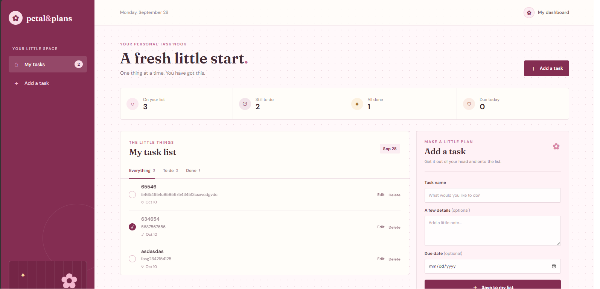
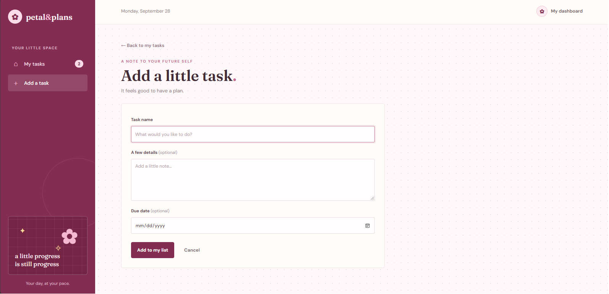
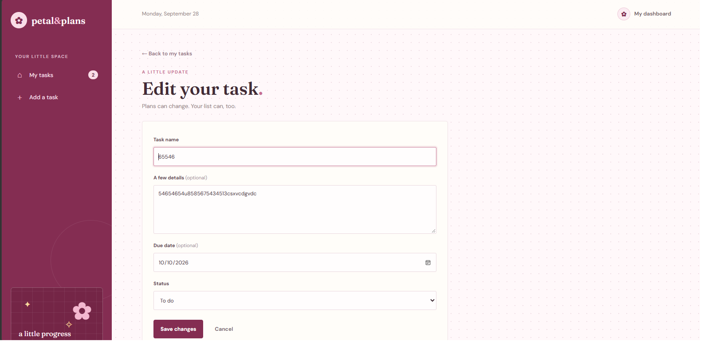

# Personal Task Manager

Project Code: WST21-PM-2026-SF   
Student Name: April Jane Soco  
Course & Year: BSIT-2  
Database Used: SQLite  

## Purpose

This project provides a simple place to organize personal tasks. Users can keep track of what needs to be done, update progress, and review completed tasks from one dashboard.

## Features

- Add task
- View tasks
- Edit task
- Delete task
- Update status (pending or completed)

## How to Use the Task Manager

Follow these steps to organize and manage your personal tasks.

### Step 1: Open the task dashboard

The dashboard is the main page of the application. It shows the task overview, task filters, and your current task list. You can also see the **Add a task** form on the right side of the page.

### Step 2: Add a task

1. Enter a task name in the **Task name** field.
2. Add notes in **A few details** if more information is needed.
3. Select a **Due date** when the task has a deadline.
4. Click **Save to my list**.

The new task will be added to the task list with a pending status.

### Step 3: Manage task progress

From the task list, you can:

1. Click the status button to mark a task as completed or return it to pending.
2. Select **Edit** to change the task name, notes, due date, or status.
3. Select **Delete** to remove a task from the list.
4. Use the **Everything**, **To do**, and **Done** filters to view tasks by status.

